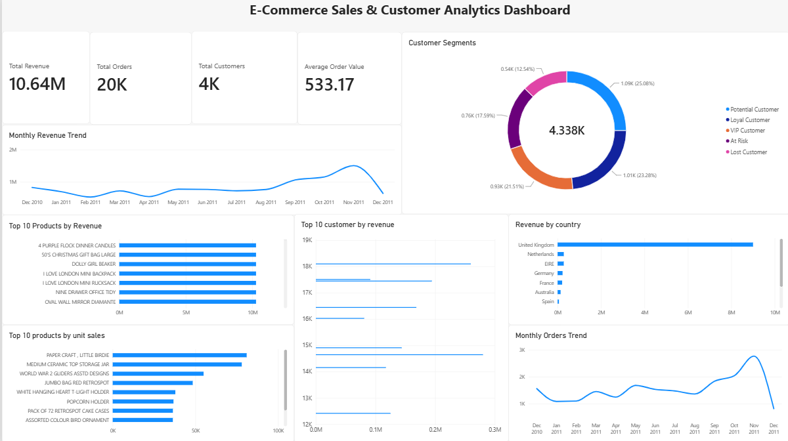

\# E-Commerce Sales \& Customer Analytics


An end-to-end data analytics project that analyzes e-commerce sales, customer behavior, product performance, and customer segments using Python, SQL, and Power BI.


\## Project Overview


This project transforms raw e-commerce transaction data into actionable business insights.


The workflow includes:


\- Data cleaning and preprocessing using Python and Pandas

\- Exploratory Data Analysis (EDA)

\- SQL-based business analysis using MySQL

\- RFM (Recency, Frequency, Monetary) customer segmentation

\- Interactive Power BI dashboard

\- KPI and sales performance analysis


\## Tech Stack


\- Python

\- Pandas

\- NumPy

\- Matplotlib

\- Seaborn

\- MySQL

\- SQL

\- Power BI

\- Jupyter Notebook

\- Git \& GitHub


\## Project Workflow


Raw E-Commerce Data

&#x20;       ↓

Python / Pandas

&#x20;       ↓

Data Cleaning

&#x20;       ↓

Exploratory Data Analysis

&#x20;       ↓

RFM Customer Segmentation

&#x20;       ↓

MySQL Database

&#x20;       ↓

SQL Business Analysis

&#x20;       ↓

Power BI Dashboard

&#x20;       ↓

Business Insights


\## Key Analysis


\### Sales Analysis


\- Total revenue

\- Total orders

\- Average order value

\- Monthly revenue trends

\- Monthly order trends

\- Revenue by country

\- Top products by revenue

\- Top products by units sold

\- Top customers by revenue


\### Customer Analysis


RFM analysis was used to segment customers based on:


\- Recency — how recently a customer purchased

\- Frequency — how frequently a customer purchased

\- Monetary — how much a customer spent


Customer segments include:


\- VIP Customer

\- Loyal Customer

\- Potential Customer

\- At Risk

\- Lost Customer


\## Power BI Dashboard




The interactive dashboard contains:


\- Revenue KPI

\- Orders KPI

\- Customer KPI

\- Average Order Value KPI

\- Monthly Revenue Trend

\- Monthly Orders Trend

\- Customer Segments

\- Top 10 Products by Revenue

\- Top 10 Products by Units Sold

\- Revenue by Country

\- Top 10 Customers by Revenue


\## Project Structure


```text

ecommerce-data-analytics/

│

├── data/

│   └── cleaned/

│       └── rfm\_customers.csv

│

├── notebooks/

│   └── ecommerce\_eda.ipynb

│

├── sql/

│   ├── analysis\_queries.sql

│   └── database\_schema.sql

│

├── src/

│   ├── data\_analysis.py

│   └── data\_cleaning.py

│

├── dashboard/

│   └── ecommerce\_dashboard.pbix

│

├── requirements.txt

├── README.md

└── .gitignore

